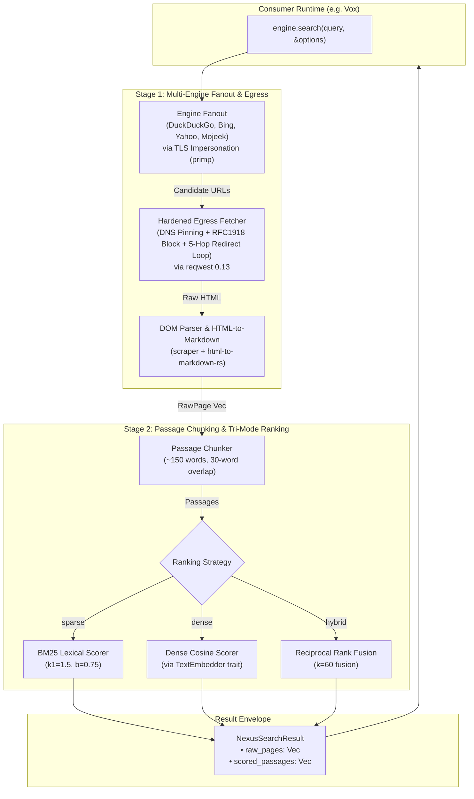

# nexus-rs

[](https://crates.io)
[](https://docs.rs)
[](LICENSE)
[](Cargo.toml)

High-performance, standalone, zero-bloat Rust library designed for agentic web search, hardened SSRF-safe page extraction, and relevance-scored passage retrieval.

---

## Overview

Modern AI agents and voice assistants require web retrieval that is **fast**, **safe**, and **token-efficient**:
1. **Keyless Multi-Provider Search**: Concurrently query web providers (DuckDuckGo, Bing, Yahoo, Mojeek) without third-party API keys or rate-limited intermediaries.
2. **Hardened Egress Defense**: Web crawlers executing LLM-prompted searches are prime targets for SSRF, DNS rebinding, and metadata exfiltration attacks. `nexus-rs` enforces pre-flight IP validation and socket pinning on every request and redirect hop.
3. **Decoupled Document & Passage Lifecycle**: Full web pages often contain tens of thousands of tokens. `nexus-rs` extracts clean Markdown, deterministically segments articles into overlapping passages, and scores them using BM25, neural vector embeddings, or Reciprocal Rank Fusion ($k=60$). Both raw documents and scored passages are returned, allowing host runtimes to dynamically enforce context token budgets and instant in-session pagination.

---

## Architecture & Data Flow



---

## SSRF Security Guarantees (`polyc-egress` Pattern)

Every outbound candidate URL is passed through an egress firewall:
- **Pre-flight DNS Evaluation**: Rejects any hostname that resolves to loopback (`127.0.0.0/8`, `::1`), RFC 1918 private subnets (`10.0.0.0/8`, `172.16.0.0/12`, `192.168.0.0/16`), link-local/cloud metadata (`169.254.0.0/16`, including AWS/GCP `169.254.169.254`), carrier-grade NAT (`100.64.0.0/10`), multicast, documentation nets, IPv6 ULA (`fc00::/7`), and IPv4-mapped IPv6 ranges.
- **DNS Rebinding Protection via Socket Pinning**: The client binds directly to the pre-flight validated socket IP address, preventing Time-of-Check to Time-of-Use (TOCTOU) DNS rebinding attacks.
- **Manual Redirect Validation Loop**: Reqwest's automatic redirect following is disabled (`Policy::none()`). Redirect targets (up to 5 hops) are individually validated against DNS and SSRF rules before following.
- **Strict Scheme Whitelist**: Rejects any scheme other than `http` or `https`.
- **System Proxy Isolation**: Ambient system and environment proxies are explicitly disabled (`.no_proxy()`).
- **Bounded Stream Reading**: Terminates download streams immediately if payload bytes exceed the configured maximum (default: 512 KB), preventing memory exhaustion attacks.

---

## Installation

Add `nexus-rs` to your `Cargo.toml`:

```toml
[dependencies]
nexus-rs = { git = "https://github.com/addy-47/nexus-rs.git" }
tokio = { version = "1", features = ["macros", "rt-multi-thread"] }
```

---

## Usage

### 1. Basic Multi-Engine Search with BM25 Ranking

```rust
use nexus::{Engine, NexusSearch, NexusSearchOptions, RankingMode, TimeFilter};

#[tokio::main]
async fn main() -> Result<(), Box<dyn std::error::Error>> {
    // Initialize the engine with selected providers
    let engine = NexusSearch::builder()
        .with_engines(vec![Engine::Duckduckgo, Engine::Bing, Engine::Yahoo])
        .with_fetch_concurrency(3)
        .build()?;

    let options = NexusSearchOptions {
        time_filter: TimeFilter::Month,
        ranking_mode: RankingMode::Sparse,
        max_candidates: 3,
        chunk_size_words: 150,
        chunk_overlap_words: 30,
        fetch_timeout_ms: 4000,
        max_response_bytes: 524_288,
    };

    let result = engine.search("rust 2024 edition features", &options).await?;

    println!("Fetched {} raw pages", result.raw_pages.len());
    for (i, passage) in result.scored_passages.iter().take(5).enumerate() {
        println!("[#{}] Score: {:.4} | {}", i + 1, passage.score, passage.source_title);
        println!("{}\n", passage.text);
    }

    Ok(())
}
```

### 2. Neural & Hybrid Ranking (RRF $k=60$)

Dense and hybrid ranking are decoupled through the `TextEmbedder` trait. The host application provides its own model inference (via ONNX, Candle, GGUF, or remote API):

```rust
use std::sync::Arc;
use async_trait::async_trait;
use nexus::{Engine, NexusError, NexusSearch, NexusSearchOptions, RankingMode, TextEmbedder};

pub struct MyOnnxEmbedder {
    // Model session handle or channel sender
}

#[async_trait]
impl TextEmbedder for MyOnnxEmbedder {
    async fn embed_text(&self, text: &str) -> Result<Vec<f32>, NexusError> {
        // Compute embedding vector
        Ok(vec![0.0f32; 384])
    }

    async fn embed_batch(&self, texts: &[&str]) -> Result<Vec<Vec<f32>>, NexusError> {
        Ok(vec![vec![0.0f32; 384]; texts.len()])
    }
}

#[tokio::main]
async fn main() -> Result<(), Box<dyn std::error::Error>> {
    let embedder = Arc::new(MyOnnxEmbedder { /* ... */ });

    let engine = NexusSearch::builder()
        .with_engines(vec![Engine::Duckduckgo, Engine::Bing])
        .with_embedder(embedder)
        .build()?;

    let options = NexusSearchOptions {
        ranking_mode: RankingMode::Hybrid, // Combines BM25 + Dense Cosine via RRF
        ..Default::default()
    };

    let result = engine.search("memory safety in systems programming", &options).await?;
    // result.scored_passages contains passages ranked by RRF score
    Ok(())
}
```

---

## Examples

Run the included examples from the repository:

```bash
# Run basic multi-engine search and BM25 ranking
cargo run --example basic_search

# Run hybrid RRF search with a custom TextEmbedder implementation
cargo run --example hybrid_search
```

---

## Configuration Reference

### `NexusSearchOptions`

| Field | Type | Default | Description |
|---|---|---|---|
| `time_filter` | `TimeFilter` | `TimeFilter::Any` | Provider query recency filter (`Any`, `Day`, `Week`, `Month`, `Year`). |
| `ranking_mode` | `RankingMode` | `RankingMode::Sparse` | Scoring algorithm (`Sparse` BM25, `Dense` Cosine, or `Hybrid` RRF). |
| `max_candidates` | `usize` | `3` | Maximum candidate search result pages to fetch and extract. |
| `chunk_size_words` | `usize` | `150` | Target passage chunk size in words. |
| `chunk_overlap_words`| `usize` | `30` | Overlap in words between consecutive passage chunks. |
| `fetch_timeout_ms` | `u64` | `4000` | HTTP fetch timeout per candidate page in milliseconds. |
| `max_response_bytes` | `usize` | `524288` (512 KB) | Byte threshold above which response streams abort. |

### `NexusSearchBuilder`

| Method | Argument | Default | Description |
|---|---|---|---|
| `.with_engines(...)` | `Vec<Engine>` | `[Duckduckgo, Bing, Yahoo]` | Enables specific search engines for query fanout. |
| `.with_embedder(...)` | `Arc<dyn TextEmbedder>` | `None` | Attaches embedder instance for dense/hybrid ranking. |
| `.with_fetch_concurrency(...)` | `usize` | `3` | Maximum concurrent page downloads. |
| `.with_fetch_timeout(...)` | `Duration` | `4000ms` | Default page fetch timeout. |
| `.with_max_response_bytes(...)` | `usize` | `512 KB` | Maximum response size cap per page. |

---

## Project Structure

```
submodules/nexus-rs/
├── Cargo.toml
├── README.md
├── examples/
│   ├── basic_search.rs
│   └── hybrid_search.rs
└── src/
    ├── builder.rs        # Fluent builder for NexusSearch
    ├── chunking/         # Sliding-window passage chunker
    ├── engines/          # Provider scrapers (DuckDuckGo, Bing, Yahoo, Mojeek)
    ├── error.rs          # Strongly typed NexusError
    ├── extraction/       # DOM repair and HTML-to-Markdown normalization
    ├── fetcher/          # SSRF firewall, DNS pinning, and redirect loop
    ├── lib.rs            # Library entrypoint and public re-exports
    ├── model.rs          # Domain structs and option envelopes
    ├── pipeline.rs       # 3-stage search, extraction, and ranking pipeline
    ├── ranking/          # Sparse BM25, Dense Cosine, and Hybrid RRF rankers
    └── traits.rs         # Async TextEmbedder trait
```

---

## License

This project is licensed under the [MIT License](LICENSE).
